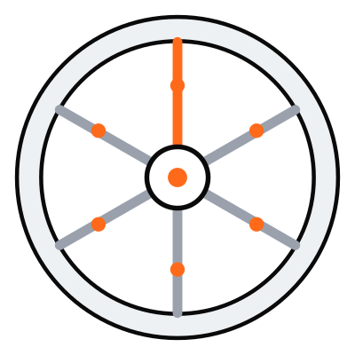

<p align="center">
  
</p>

# FLYWHEEL.md

**How autonomous agents ship and improve real software, end to end.**

The third file in the agent canon:

| File | Says |
|------|------|
| [`AGENTS.md`](https://agents.md) | what to do |
| [`SOUL.md`](https://soul.md) | who to be |
| **`FLYWHEEL.md`** | **how to ship, and how to know you did** |

Read the manifesto at **[flywheel.md](https://flywheel.md)**.

## Why

Writing code was never the hard part. Shipping it, and proving it works in production, is. Close that loop with discipline and software starts improving itself, safely. Close it without and you get confident, untested, unobservable change at machine speed.

## The loop

**Ship → verify → learn → improve.** The wheel spins faster every turn.

## The bar

- **Done means deployed and verified, with evidence.** A diagnosis is not a fix. A merge is not a deploy. A deploy is not a verification.
- **Every iteration costs money.** Treat request volume like a budget you can blow.
- **Know your data flow.** "Works on my machine" is the most expensive lie an agent tells.
- **Fix the cause, never the symptom.** Never skip a check to go green.
- **Leave a trail.** The next turn of the loop shouldn't relearn what this one did.

Full text: [`FLYWHEEL.md`](./FLYWHEEL.md).

## Adopt it

Drop [`FLYWHEEL.md`](./FLYWHEEL.md) in your repo root, next to `AGENTS.md` and `SOUL.md`. Your agents read it before they touch anything.

```
your-repo/
├── AGENTS.md      # what to do
├── SOUL.md        # who to be
└── FLYWHEEL.md    # how to ship
```

Steal it, fork it, make it yours. No attribution needed.

## License

[MIT](./LICENSE). The manifesto text is free to copy and adapt.

---

*A loop you can't see is a liability. FLYWHEEL.md grew out of running real agents in production; pair it with observability that shows every iteration, every cost, every change.*
